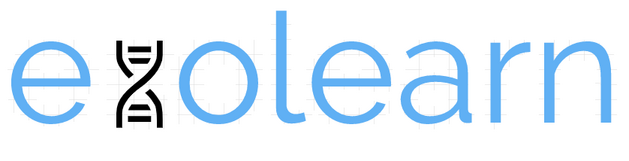

Welcome to evolearn's documentation!
===================================

evolearn is a Python library for GA tools for machinea learning.

Check out the :doc:`usage` section for further information, including
how to :ref:`installation` the project.

Contents
--------
.. toctree::
   :maxdepth: 1
   :caption: Contents:

   Quick Start <Quick-Start>
   Python Quick Start <Python-Intro>
